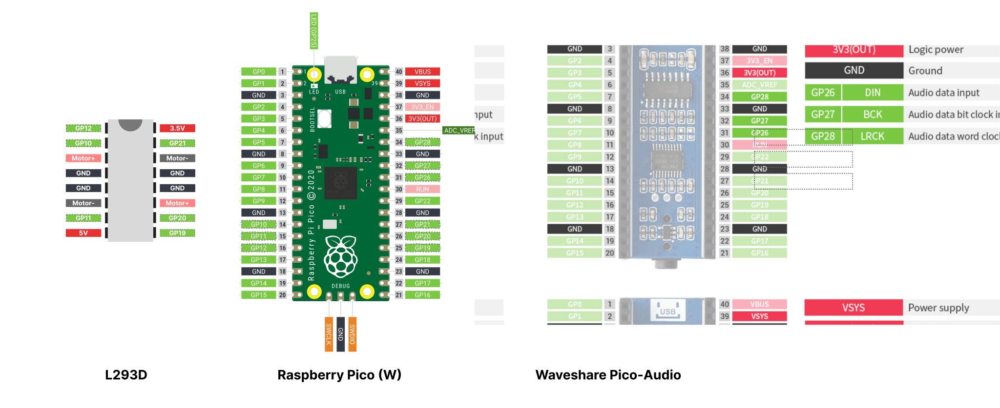

# 🤖 BaustellRoboter

## Components used

### Waveshare Pico-Audio (Inital Version)
Uses pins GP26, GP27 and GP28. See more info [here](https://www.waveshare.com/wiki/Pico-Audio)
### L293D
Uses pins GP10 - 12 and GP19-21
